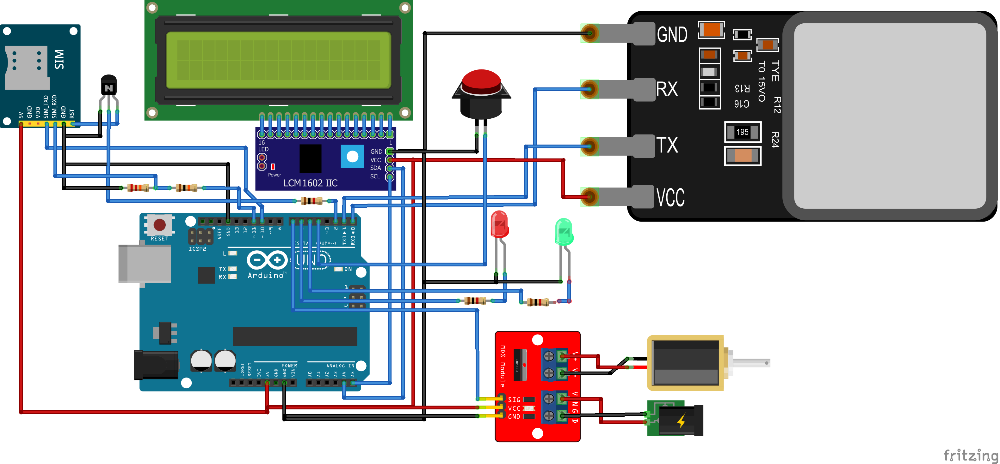

# ArduinoFPSDoorLockSMSOTP
  
# 
  
## Table of contents
  
* [Libraries](#Libraries)
* [Pins](#Pins)
* [Tutorials](#Tutorials)
  
## Requirements
  
#### `Libraries`
  
* [**Adafruit_Fingerprint.h**: _Secure your project with biometrics - this all-in-one optical fingerprint sensor will make adding fingerprint detection and verification super simple._](https://github.com/adafruit/Adafruit-Fingerprint-Sensor-Library)
* [**Sim800L.h**: _The Purpose of This library is to use the module in the most easy way and transparent._](https://github.com/VittorioEsposito/Sim800L-Arduino-Library-revised)
* [**LiquidCrystal_I2C.h**: _The library allows to control I2C displays with functions extremely similar to LiquidCrystal library_](https://github.com/fdebrabander/Arduino-LiquidCrystal-I2C-library)
  
#### `Pins`
  
* SMS_RX 			10  
* SMS_TX 			11  
* SMS_RESET 		2  
* SDA				A4  
* SCL				A5  
* FPS_RX			0  
* FPS_TX			1  
* OPEN_PIN			3
* LOCK_DRIVER		4  
* GREEN_PIN			5  
* RED_PIN			6   
 
#### `Tutorials`
  
* [**Referrence**: _How to Create a Fingerprint Sensor Door Lock With an Arduino UNO_](https://maker.pro/arduino/projects/how-to-create-a-fingerprint-reading-door-lock-system-with-an-arduino-uno)  
* [**SIM800L**: _Library SIM800l Module for Arduino UNO_](https://github.com/cristiansteib/Sim800l)  
* [**SIM800L**: _Send Receive SMS & Call with SIM800L GSM Module & Arduino_](https://lastminuteengineers.com/sim800l-gsm-module-arduino-tutorial/)  
* [**LiquidCrystal_I2C**: _How to Use I2C Serial LCD 20X4_](https://www.instructables.com/id/How-to-Use-I2C-Serial-LCD-20X4-Yellow-Backlight/)  
